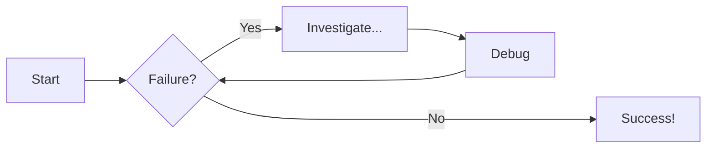
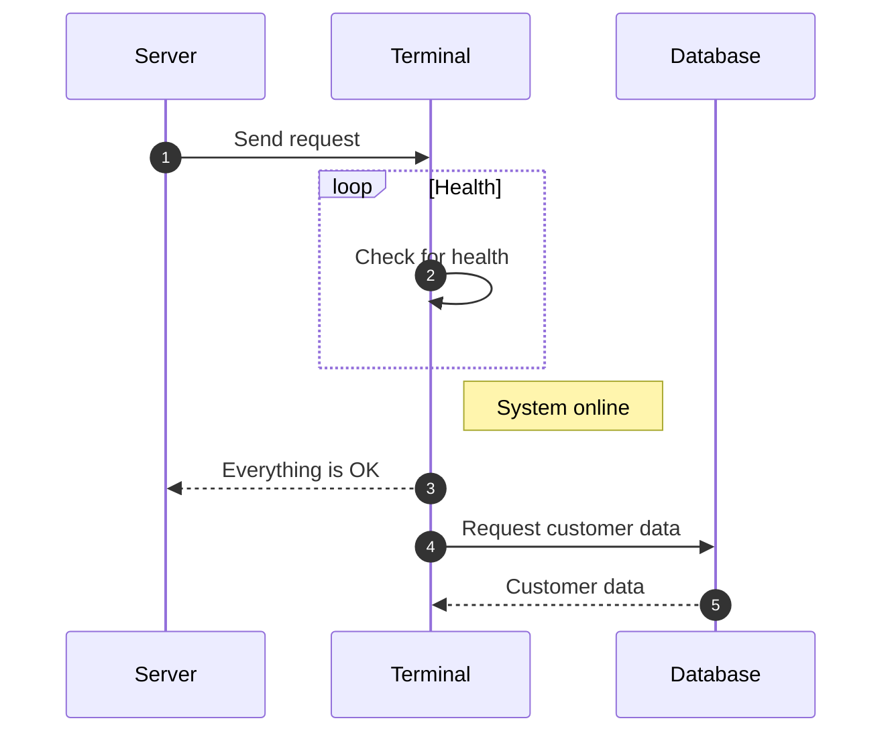

*Testing emojis added to this site* :tea: :cat:

# Diagrams    

## Flowcharts
Flowcharts are diagrams that represent workflows or processes

## Sequence Diagrams
Sequence diagrams describe a specific scenario as sequential interactions between multiple objects

